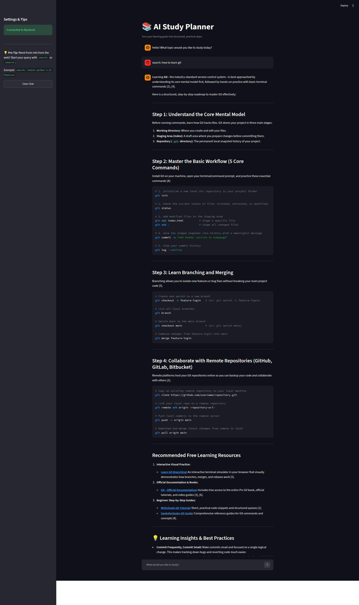

# AI Study Planner

An AI study planning application that uses Google Gemini to help turn study questions and goals into practical next steps.

The project has two services:

1. A Streamlit chat interface for interactive use.
2. A FastAPI backend that is the only service allowed to call Gemini and web search.

The Gemini client also supports web-assisted research when a message starts with `search:` or `/search `.

## Project Structure

```text
study-planner/
├── backend/
│   ├── app.py
│   └── gemini_client.py
├── ui/
│   └── app.py
├── .env
├── requirements.txt
└── README.md
```

- `backend/gemini_client.py` configures Gemini and contains the chat and web-search logic.
- `backend/app.py` exposes the FastAPI API and owns all model requests.
- `backend/gemini_client.py` is loaded only by FastAPI and owns Gemini and web-search access.
- `ui/app.py` contains the Streamlit chat interface and sends messages to FastAPI over HTTP.
- `requirements.txt` lists the Python dependencies.
- `.env` stores local configuration such as the Gemini API key.

## Requirements

- Python 3.9 or newer
- A Google AI API key
- Internet access for Gemini requests
- Internet access for web search messages

## Setup

From this directory, create and activate a virtual environment:

```bash
python3 -m venv venv
source venv/bin/activate
```

Install the dependencies:

```bash
python -m pip install -r requirements.txt
```

Create a `.env` file in the `study-planner/` directory:

```env
GEMINI_API_KEY=your_api_key_here
```

`python-dotenv` loads this value in the backend, and `google-genai` uses it when creating the Gemini client. Streamlit does not load `.env`, import `GeminiClient`, or access the Gemini API key.

Do not commit `.env` or expose your API key. Add `.env` to `.gitignore` if it is not already ignored.

If an API key is ever exposed in a terminal, screenshot, log, or repository, revoke it immediately in Google AI Studio and create a replacement key.

## Run the Application

Start the FastAPI backend first in one terminal:

```bash
python backend/app.py
```

The backend runs at `http://127.0.0.1:8000`.

In a second terminal, activate the same virtual environment and start Streamlit:

```bash
streamlit run ui/app.py
```

Open the URL printed by Streamlit, usually:

```text
http://localhost:8501
```

Enter a study topic, question, or goal in the chat box. Conversation history is kept in the current Streamlit session.

Streamlit sends each message to `POST http://127.0.0.1:8000/api/chat`. It never calls Gemini or DuckDuckGo directly.

To use a different backend address, set `BACKEND_URL` before starting Streamlit:

```bash
BACKEND_URL=http://127.0.0.1:8001 streamlit run ui/app.py
```

## Run the FastAPI Backend

FastAPI is required for the Streamlit application. Start it from the project directory with:

```bash
python backend/app.py
```

The API runs at:

```text
http://127.0.0.1:8000
```

The interactive API documentation is available at:

```text
http://127.0.0.1:8000/docs
```

The FastAPI backend does not serve the Streamlit page. It acts as the trusted server-side layer between Streamlit and external services.

## Request Flow

```text
Browser
	-> Streamlit UI
	-> FastAPI /api/chat
	-> GeminiClient
	-> DuckDuckGo when search is requested
	-> Gemini
	-> FastAPI response
	-> Streamlit UI
```

Only the FastAPI process loads `GEMINI_API_KEY`. The browser and Streamlit process never receive that key.

## API Usage

Send a message to the chat endpoint:

```bash
curl -X POST http://127.0.0.1:8000/api/chat \
	-H "Content-Type: application/json" \
	-d '{"message":"Create a two-week study plan for Python basics."}'
```

Successful responses have this shape:

```json
{
	"response": "..."
}
```

An empty message returns a `400` response:

```json
{
	"error": "No message provided"
}
```

## How It Works

### 1. Load configuration

```python
load_dotenv()
client = genai.Client(api_key=os.getenv("GEMINI_API_KEY"))
```

The API key is loaded from `.env`. The Gemini client creates a chat session using the model configured in `backend/gemini_client.py`.

### 2. Generate a study response

Normal messages are sent directly to the Gemini chat session:

```python
response = self.chat.send_message(user_input)
```

The response is displayed in Streamlit or returned by the FastAPI endpoint.

### 3. Use web-assisted research

Prefix a message with `search:` or `/search `:

```text
search: effective spaced repetition techniques
```

The application retrieves search results with `duckduckgo-search`, adds them to the prompt, and asks Gemini to synthesize an answer with inline source references.

### 4. Maintain Streamlit conversation history

The Streamlit UI stores messages in `st.session_state`. This keeps the conversation visible while the current browser session is active.

## Dependencies

- `google-genai` - Google Gemini API client.
- `python-dotenv` - Loads environment variables from `.env`.
- `streamlit` - Interactive chat interface.
- `fastapi` - Optional JSON API framework.
- `uvicorn` - ASGI server for FastAPI.
- `duckduckgo-search` - Web search for research-prefixed prompts.
- `requests` - HTTP client dependency for integrations.

## Troubleshooting

### Gemini API key error

Confirm that `.env` is in the `study-planner/` directory and contains:

```env
GEMINI_API_KEY=your_api_key_here
```

Restart Streamlit or FastAPI after changing the file.

### Model not found

The Gemini model name is configured in `backend/gemini_client.py`. If Google changes model availability, update the `model=` value to a model available to your API key and installed SDK.

### `ModuleNotFoundError`

Activate the project virtual environment and reinstall dependencies:

```bash
source venv/bin/activate
python -m pip install -r requirements.txt
```

### Port already in use

Start Streamlit on another port:

```bash
streamlit run ui/app.py --server.port 8502
```

Start FastAPI on another port by changing the `uvicorn.run` configuration in `backend/app.py` or by using Uvicorn directly:

```bash
uvicorn backend.app:app --host 127.0.0.1 --port 8001
```

## Limitations

- Streamlit conversation history is limited to the active session.
- The application does not persist study plans to a database.
- Gemini and web-search requests require network access.
- The API key must be configured before using the application.
- The model name is currently configured in `backend/gemini_client.py`.
- Web search results may be unavailable or change over time.

## Possible Next Steps

- Add structured study-plan output with tasks, dates, and priorities.
- Add user-selectable subjects, time limits, and learning goals.
- Persist plans and progress in a database.
- Add authentication and per-user sessions.
- Add tests for the Gemini client, API validation, and Streamlit workflows.
- Move the model name and generation settings into environment variables.


